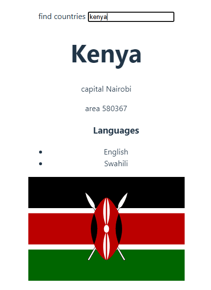

  <h1>Countries Data UI</h1>
  
A website based on University of Helsinki's countries API

## About
A countries web application where you can search for a target country and view a summary of its basic information including its current weather conditions.

Live demo: https://countrycard.onrender.com/

## Features

### Asynchronous fetches
* Pulls in data about the countries from [restcountries](https://studies.cs.helsinki.fi/restcountries/)

## Getting Started

Follow the installing instructions below to run the project on your local machine

### Dependencies

The website is written in React,

### Installing

### React + Vite

This template provides a minimal setup to get React working in Vite with HMR and some ESLint rules.

Currently, two official plugins are available:

- [@vitejs/plugin-react](https://github.com/vitejs/vite-plugin-react/blob/main/packages/plugin-react/README.md) uses [Babel](https://babeljs.io/) for Fast Refresh
- [@vitejs/plugin-react-swc](https://github.com/vitejs/vite-plugin-react-swc) uses [SWC](https://swc.rs/) for Fast Refresh

## Built With

### Frontend

* React

### Backend

* Render

